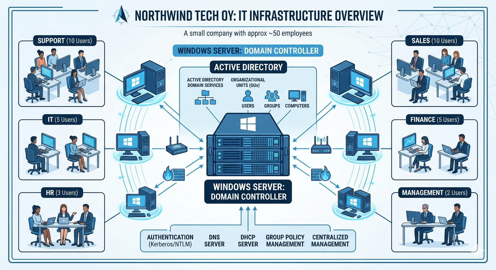

# project-it-environment

> Built using Windows Server & Active Directory  
> 📅 April–May 2026  
> 💻 VMware Lab Environment

## **1 JOHDANTO**

Tämän projektin tavoitteena on suunnitella ja toteuttaa Northwind Tech Oy:n IT-ympäristö. Projekti keskittyy erityisesti toimialueympäristön (Active Directory) käyttöönottoon sekä palvelin- ja työasemaympäristön kehittämiseen.

Northwind Tech Oy on kuvitteellinen yritys, jota käytetään tässä projektissa esimerkkinä. Yrityksessä työskentelee noin 35 henkilöä eri osastoilla, kuten IT, myynti, talous ja asiakaspalvelu.

Projektin aikana toteutetaan palvelimen asennus, toimialueen luonti, käyttäjien ja ryhmien hallinta sekä perusasetusten määrittely. Lisäksi huomioidaan järjestelmän ylläpito ja tietoturva.

****

## **2 PROJEKTISUUNNITELMA**  

Pienen yrityksen IT-ympäristön rakentaminen ja helpdesk-tuki  
\_\_\_\_\_\_\_\_\_\_\_\_\_\_\_\_\_\_\_\_\_\_\_\_\_\_\_\_\_\_\_\_\_\_\_\_\_\_\_\_\_\_\_\_\_\_\_\_\_\_\_\_\_\_\_\_\_\_\_\_\_\_\_\_

| Opiskelija | Heyiredin Daniel Sema |
| :---- | :---- |
| **Koulutus** | Tieto- ja viestintätekniikan perustutkinto |
| **Osatutkinnot** | Teknisessä tukipalvelussa toimiminen (TTT) · Järjestelmätuessa toimiminen (JT) |
| **Ajankohta** | 7.4.2026 – 5.6.2026 |
| **Oppilaitos** | Taitotalo, Helsinki |
| **Ohjaaja / Arvioija** | Kari Vikman · [kari.vikman@taitotalo.fi](mailto:kari.vikman@taitotalo.fi) |
| **Tavoitearvosana** | Hyvä 4 |
| **Versio** | 2.0 · Laadittu 7.4.2026 |

## **2.1 Projektin tarkoitus** 

Tämä projekti on näyttö Taitotalon IT-koulutuksessa. Rakennan pienen yrityksen IT-ympäristön virtuaalikoneilla. Harjoittelen IT-tuen ja järjestelmätuen työtehtäviä.

Projektin avulla osoitan osaamiseni järjestelmätuen ja IT**\-**tuen työtehtävissä

## **2.2 Fiktiivinen asiakas** 

| Yrityksen nimi | Northwind Tech Oy |
| :---- | :---- |
| **Henkilöstö** | 50 käyttäjää |
| **Toimiala** | Konsultointi |
| **IT-ympäristö** | Paikallinen palvelin \+ Windows-työasemat |
| **Asiakastarve** | Domain, käyttäjät, GPO, vakioitu työasema, perus-helpdesk-tuki |

## **3\. PROJEKTIN TAVOITTEET** 

## **3.1 Järjestelmätuen tavoitteet:** 

* Asennan Windows Server 2022 \-palvelimen  
* Teen Active Directory \-domainin  
* Luon käyttäjät, ryhmät ja OU-rakenteen  
* Määritän GPO-käytännöt (esim. ruudunlukitus, USB-esto)  
* Teen varmuuskopion ja testaan palautuksen  
* Seuraan palvelimia (monitorointi)

## **3.2 Teknisen tukipalvelun tavoitteet:**   

* Asennan Windows 10/11 \-työaseman ja liitän domainin  
* Asennan tarvittavat sovellukset  
* Luon 4–6 fiktiivistä helpdesk-tukipyyntöä ja ratkaisen ne  
* Harjoittelen etäyhteyttä (RDP)  
* Dokumentoin kaikki tukipyynnöt

**3.3 Dokumentaation tavoitteet:**

* Kirjoitan projektisuunnitelman, asennusraportit ja tietoturvakuvauksen  
* Teen kuvakaappauksia jokaisesta työvaiheesta  
* Kirjoitan päiväkirjaa joka työpäivä

## **4\. TEKNINEN YMPÄRISTÖ**

| Virtualisointiympäristö | VMware |
| :---- | :---- |
| **Palvelin** | Windows Server 2022 (virtuaalikone) |
| **Työasema** | Windows 10 / 11 (virtuaalikone) |
| **Hakemistopalvelu** | Active Directory Domain Services (AD DS) |
| **Pilvipalvelu (valinnainen)** | Microsoft 365 Developer Tenant |
| **Komentorivi** | PowerShell |
| **Tiedostojen tallennus** | OneDrive (varmuuskopiot \+ dokumentit) |
| **Kommunikaatio** | Microsoft Teams |
| **Projektinhallinta** | ProjectLibre |

**5.PERUSTOIMINTO:** 

## **5.1 Active Directoryn käyttöönotto** 

* Tavoite:  
   Määrittää Active Directory **\-**toimialue alusta alkaen.  
* Vaiheet:  
* Asenna Windows Server virtuaalikoneeseen.  
* Ylennä palvelin toimialueen ohjaimeksi (Domain Controller, DC).  
* Luo Active Directory **\-**toimialue.  
* Luo organisaatioyksiköt (OU:t) eri osastoja varten.  
* Luo käyttäjätilit ja ryhmät näihin organisaatioyksiköihin.

## 📑 Sisällysluettelo

- #projektin-yleiskuvaus
- #tekninen-ympäristö
## 📅 Viikkokohtainen työ

- ✅ [Week 1 – Suunnittelu & alkuasetukset](docs/week-1.md)
- 🖥️ [Week 2 – Virtuaaliympäristö](docs/week-2.md)
- ⚙️ [Week 3 – Palvelimen asennus](docs/week-3.md)
- 🔐 [Week 4 – Active Directory](docs/week-4.md)
- 👥 [Week 5 – Käyttäjät & ryhmät](docs/week-5.md)
- 🛠️ [Week 6 – GPO & määritykset](docs/week-6.md)
- ✅ [Week 7 – Testaus & dokumentaatio](docs/week-7.md)
---

# 📅 VIikkokohtainen työ

---

## Week 1 – Suunnittelu & alkuasetukset

### 🔧 Tehtävät
- Projektin suunnittelu
- Vaatimusten määrittely
- VMware asennus
- Windows Server ISO lataus
  >>## [Week 1 – Suunnittelu & alkuasetukset](docs/week-1.md)
  

